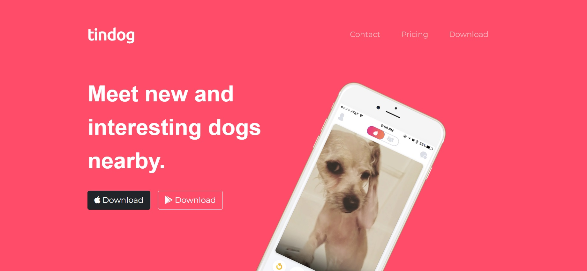
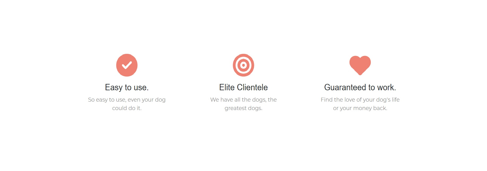
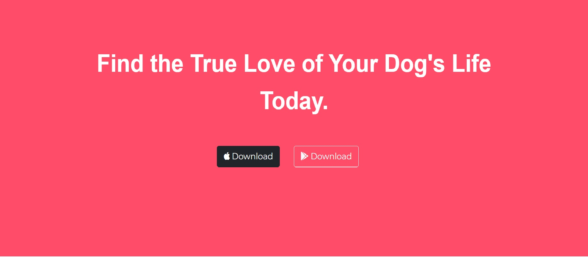

<h1 align="center">TinDog</h1>

<p align="center">
</p>

<h2 align="center"><a href="https://abhisheksharma1310.github.io/tinDog-web/">👆 Clike here for Live Demo 💻</a></h2>

---

## Description

**TinDog website**

<p align="center">
</p>

<h3 align="center">TinDog Website Desktop View - a live demo</h3>

TinDog website a simple static and responsive website using html, css and bootstarp library.

---

## Technologies used

- Html
- Css
- Bootstrap libray

---

## Website Features

- Navbar and Title section

<p align="center">
</p>

- Features section

<p align="center">
</p>

- Testimonials section

<p align="center">
</p>

- Call to action section

<p align="center">
</p>

- Footer section

<p align="center">
</p>

---

## Website Installation Instructions

- Clone tinDog-web

- Go to project directory

- Run website

```
git clone https://github.com/abhisheksharma1310/tinDog-web.git
cd tinDog-web/
```

